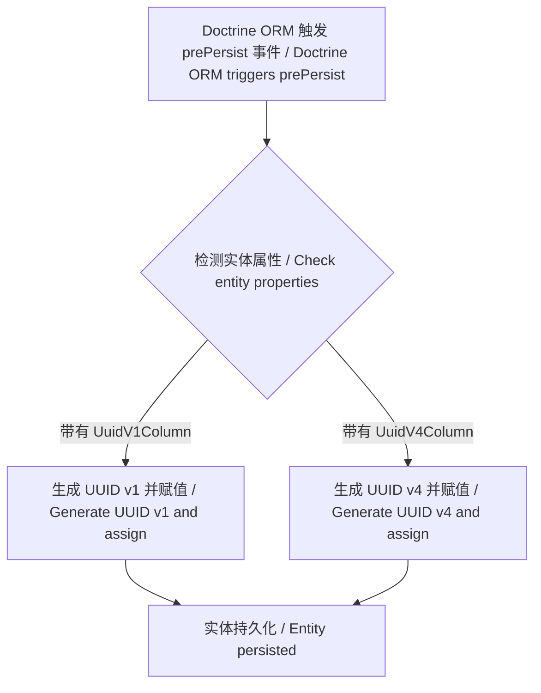

# Doctrine UUID Bundle 工作流程 / Workflow Diagram

```mermaid
flowchart TD
    A[Doctrine ORM 触发 prePersist 事件 / Doctrine ORM triggers prePersist] --> B{检测实体属性 / Check entity properties}
    B -->|带有 UuidV1Column| C[生成 UUID v1 并赋值 / Generate UUID v1 and assign]
    B -->|带有 UuidV4Column| D[生成 UUID v4 并赋值 / Generate UUID v4 and assign]
    C --> E[实体持久化 / Entity persisted]
    D --> E
```

> 本流程适用于所有通过 Attribute 标记的实体属性，事件监听器自动完成赋值。
